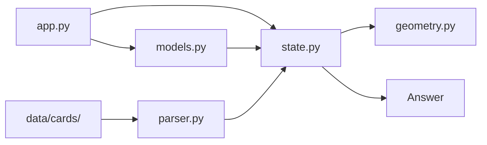

# Flashcards App

Flashcard project is a Dash application for visualizing learning flashcards in 3D space. It serves as a multi purpose barebone for model training and evaluation. Goal is to analyse the processed data inside the workflow along the RAG's steps and fine tune the output.

## Structure

## Core Architecture

[Testing link: Card Progress](./flashcards_app/models.py#CardProgress:)
relative links do not work like this, if need to go down to path, this would only work from root directory.

[Testing link: Card Progress](.~./flashcards_app/models.py#CardProgress:)

### Main App (app.py)
Dashboard layout with 3D map: 3D scatter plot
Side panels: UI controls for selection, progress, grouping, connections

### Visual 3D Geometry (flashcards_app/geometry.py)
Generates reproducible random points inside a sphere
Ensures points stay inside the unit sphere
Framework: Dash (Plotly) with Flask for boot-id endpoint
Visualization: Plotly 3D Scatter plots showing cards on a sphere
**Extensive callback system for interactivity**

### Data Organization (data/cards/)
6 markdown decks covering Data Science topics
Format: 

<b><sd Question?</b> Answer text

Data Format: Markdown format for Q&A

### Parser (flashcards_app/parser.py)
Parses markdown files with 
/
 format
Extracts questions from 
 and answers from the body
Handles technical term formatting

### State Management (flashcards_app/state.py)
Load/save positions, progress, groups, links to JSON
Generate deterministic sphere positions
Load enabled decks from state
State Persistence: JSON file (data/positions.json) for positions, progress, groups, and links

### Data Models (flashcards_app/models.py)
Datacards for Flashcard, CardPosition, CardProgress, CardGroup, CardLink

- Flashcard: id, deck, question, answer
- CardPosition: card_id, x, y, z coordinates
- CardProgress: card_id, read status, difficulty (1-100)
- CardGroup: id, name, color, card_ids
- CardLink: source_id, target_id, group_id

## Into RAG
(Map shows currently filtered/unfiltered context as dots)
parsed / preprocessed docs --> chunks --> Decks: filter by manual (selection) ingestion
assignung group, color, connection --> embedded --> Groups: similarity search, vectors
display question and answer --> context --> Card text: only answer is needed 
