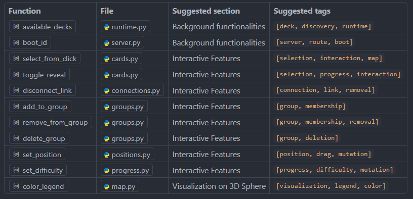

1. Component IDs / file paths / line numbers — ✅ all correct
Checked every entry against the actual source (models.py, parser.py, state.py, geometry.py, runtime.py, server.py, callbacks.py, services/*.py, visualization/*.py). All  paths exist, and every line_start/line_end matches the real function/class boundaries — no drift found this time.

2. Unindexed components (11 found) — not even in the "Unindexed Components" section
These exist in code but are invisible to the index, because update_index.py only detects connections through plain imported-name calls — it doesn't resolve module_alias.function() attribute-call patterns (e.g. runtime.available_decks(), cards_service.pick_random()), so these never register as "connected" to anything already indexed:

(Per the index's own maintenance rule, these are suggestions for location + tags only — not component_id/file/line_start/line_end, which you'd fill in when moving them into the index.)

3. Dependency/used_in accuracy — issues found

- callbacks:update_card dependencies list is incomplete: it calls cards:pick_random, cards:pick_adjacent, cards:select_from_click, cards:toggle_reveal, decks:add_enabled_deck, decks:remove_enabled_deck, connections:create_link, connections:disconnect_link, groups:create_group, groups:add_to_group, groups:remove_from_group, groups:delete_group, positions:set_position, progress:set_difficulty — none of these are listed, only a subset (map/panels/runtime/state) is.

- decks:add_enabled_deck and decks:remove_enabled_deck both call runtime.refresh_deck_state() (an indexed component) but runtime:refresh_deck_state is missing from their dependencies lists.

- panels:deck_control depends on runtime:available_decks() but can't reference it since that component isn't indexed yet (see #2).

Root cause: this is systemic, not a one-off — update_index.py's static analysis resolves direct function calls but not module_alias.function() attribute calls, which is now the dominant calling convention after the restructuring (services/runtime are always accessed as X_service.method() or runtime.X). This will keep causing gaps going forward unless the scanner is taught to resolve those patterns, or calls are changed to from ... import function style.

No other issues found.